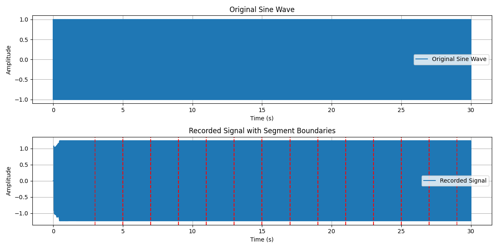
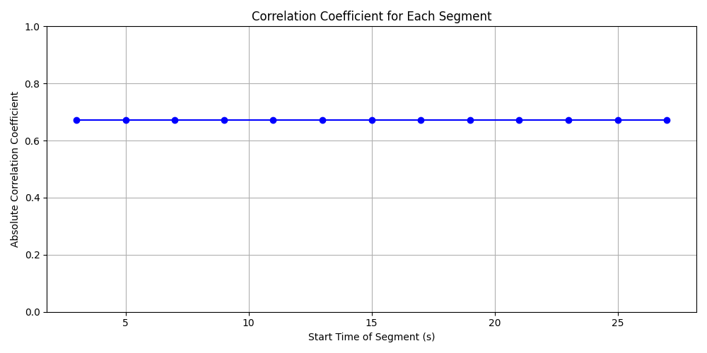
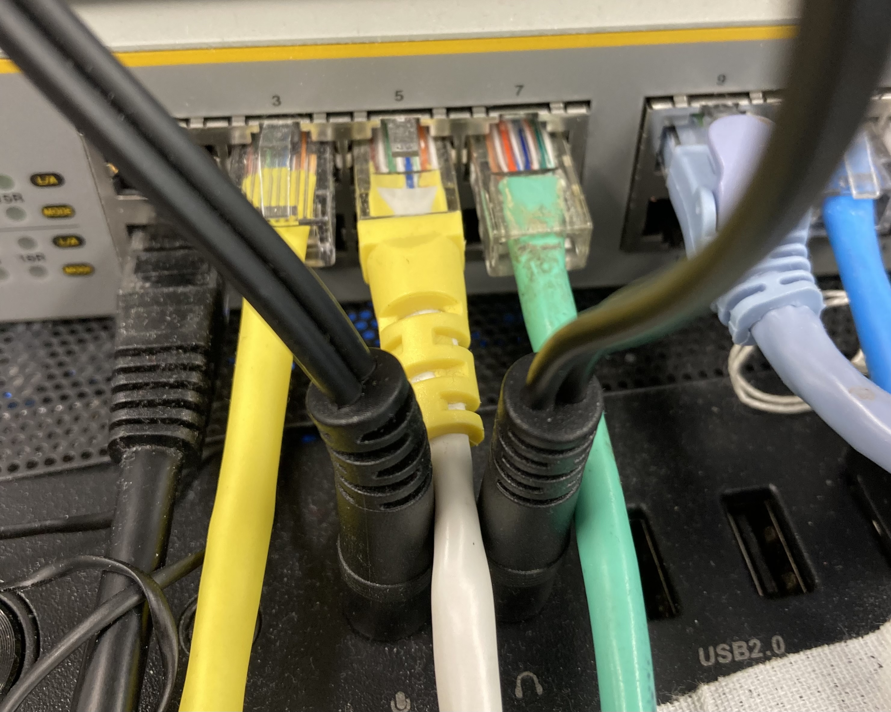
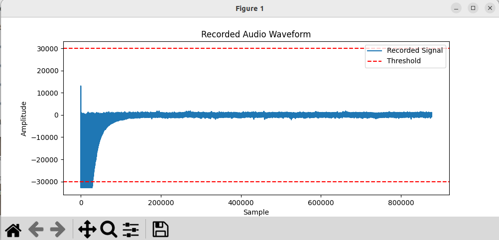

# soundtester
- Ubuntu(Linux) sound input output check simply
# soundtester v2
- File is named noisetester.py

```python

python noisetester.py

```
> [!TIP]
> Loopback sound play and rec sine wave
> If Play and Rec normal coefficient scores are over threshold, test is passed.




  
# Audio loop back test


# Create wave sound file for the test

```python

python baseoto.py

```
- test_tone.wav is created.
- This file is used loopback sound test

##  device number channel check 

```python
python device_check.py

```

# Execute sound test

```python
python noisecheck.py

```
When test is finished, result graph is displayed.




# Requirement modules
- matplotlib
- pyaudio
- numpy
- os
- scipy

# plan
- I want to improve this sound checker for the inspection system for linux(Ubuntu) system.

